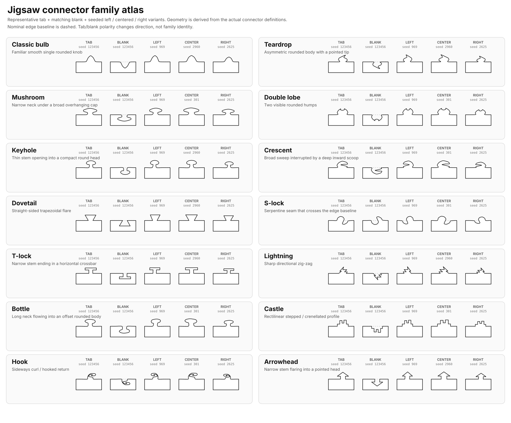
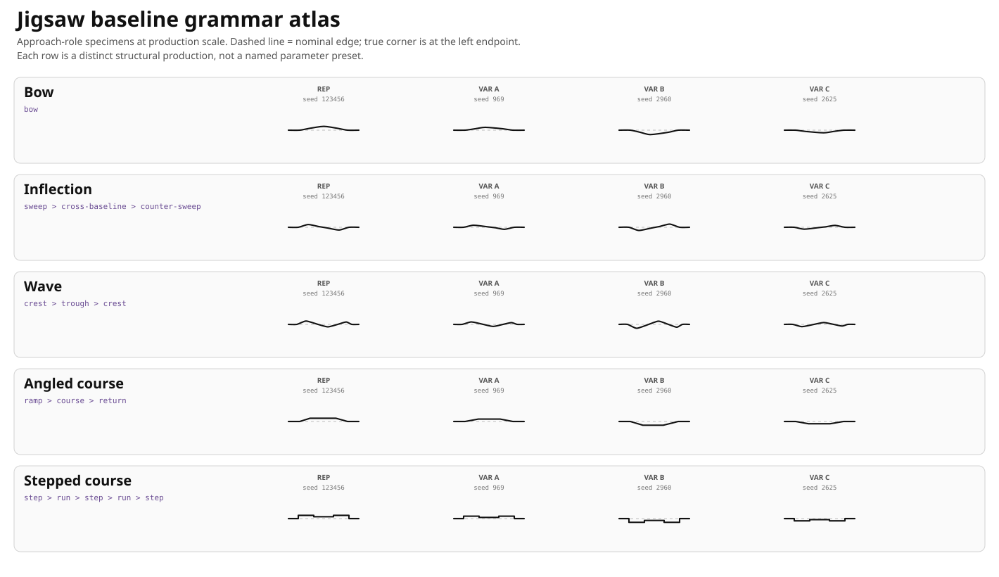

# Jigsaw Connector Grammar Design

Puzzle Forge's ordinary Jigsaw connector system is **grammar-first**.

A connector family is not a named preset inside one universal bump formula. It is a distinct structural production: a different sequence of geometric events that cannot become another family merely by changing width, depth, lean, roundness, or other continuous parameters.

The implementation lives in:

- `src/games/jigsaw/connectorGrammar.ts` — structural connector grammar definitions, seeded program derivation, and normalized realization;
- `src/games/jigsaw/baselineGrammar.ts` — structural baseline grammar definitions, seeded program derivation, and normalized realization;
- `src/games/jigsaw/seamProgram.ts` — seeded approach / connector / departure composition;
- `src/games/jigsaw/edgeProfiles.ts` — puzzle-level selection weights for the connector grammar catalog;
- `src/games/jigsaw/edgePaths.ts` — shared placement, polarity, complementarity, curve rendering, orientation, and validation sampling.

The current grammar catalog is deliberately small. **Eight strong grammars are preferable to fourteen labels that collapse into the same geometry.**

The numeric ranges in this document are a tuning snapshot, not a compatibility or versioning contract.

## Core rule: structure before parameters

A family earns a catalog entry only when it has a different structural derivation.

Two proposed families are the same family if one can be continuously transformed into the other by changing ordinary parameters without adding or removing a structural event such as:

- a lobe;
- saddle;
- undercut;
- backtrack;
- scoop;
- baseline crossing;
- chamber/waist cycle;
- orthogonal step/plateau;
- angular zig/zag turn.

This is the distinction that invalidated several earlier families.

For example, the previous **Mushroom**, **Keyhole**, and **Bottle** labels all reduced to the same essential production:

```text
neck -> undercut -> head -> undercut -> neck
```

Stem length, cap width, asymmetry, and roundness were parameter differences, not family differences.

The same scrutiny removed **Dovetail**, **T-lock**, and **Arrowhead** as separate ordinary families. A different head angle or rendering style is not sufficient reason to mint a new structural family.

## Generation pipeline

The ordinary system is intentionally layered:

```text
puzzle RNG
   |
   v
choose one connector grammar for the puzzle
   |
   v
derive independently weighted baseline roles + connector
for each shared SeamProgram
   |
   v
realize the program into normalized 2D geometry
   |
   v
seeded width / depth / placement / lean / handedness
   |
   v
shared polarity + reciprocal-edge transforms
   |
   v
line / cubic rendering
   |
   v
bounds + self-intersection + whole-piece safety
```

The renderer is shared. The grammar is not.

This matters: shared Bézier machinery does not make two grammars equivalent any more than a shared SVG renderer makes two drawings the same drawing.

## Rollout model

For the initial rollout, a generated puzzle chooses **one ordinary connector grammar for the entire game**. Baseline grammars are then selected independently for each seam's approach and departure roles.

Individual seams still vary deterministically by seed:

- continuous dimensions;
- placement along the edge;
- lean;
- handedness for directional grammars;
- family-specific program parameters;
- bounded repeat counts where the production permits them;
- tab/blank polarity.

So one puzzle has a coherent cut personality without stamping exact clones around the board.

## Current grammar catalog

| Grammar | Structural production | Fastest recognition cue |
| --- | --- | --- |
| Classic bulb | `lobe` | One ordinary smooth crown, no reversal or secondary event |
| Necked head | `neck > undercut > head > undercut > neck` | Narrow shaft opens into one overhanging chamber |
| Multi-lobe | `repeat(lobe > saddle){2..4}` | Several side-by-side crowns separated by saddles |
| Scoop | `outer-sweep > scoop > return` | Broad sweep doubles back into a deep one-sided bite |
| Serpentine | `lobe > cross-baseline > opposed-lobe` | Seam deliberately occupies both sides of the baseline |
| Terrace | `repeat(step > plateau){2..4}` | Orthogonal staircase / skyline |
| Zigzag | `repeat(zig > zag){2..4}` | Repeated diagonal angular turns |
| Stacked lock | `chamber > waist > chamber` | Two chambers stacked outward from the edge with a narrow waist |

## Graphical atlas

The atlas below is generated from the canonical seam geometry rather than illustrated by hand.



Each grammar should show:

- **TAB** — one representative outward seam;
- **BLANK** — the same seeded seam with inverse polarity;
- **LEFT / CENTER / RIGHT** — seeded variants chosen to expose legal placement variation.

The dashed horizontal line is the nominal uncut edge.

The atlas is the fastest practical test of the catalog rule: if two rows look like the same construction with different measurements, the catalog is wrong even if their names and descriptions sound different.

[Open the atlas directly](./assets/jigsaw-connector-family-atlas.svg)

## Structural grammar details

### 1. Classic bulb

**Production**

```text
lobe
```

**Identity:** the conventional baseline. One smooth rise, one crown, one fall.

**Must not contain:** a neck, true undercut, saddle, baseline crossing, repeated chamber, or internal scoop.

**Seeded variation:** crown height, shoulder position, overall span/depth, edge placement, and slight lean.

**Rendering:** smooth cubic.

**Current tuning:**

- span scale: 64–82%;
- depth scale: 18–26%;
- corner buffer: 7%;
- curve tension: 0.12.

This family exists partly as a control specimen: if another grammar cannot be distinguished from Classic bulb immediately, the other grammar is not doing enough.

---

### 2. Necked head

**Production**

```text
neck > undercut > head > undercut > neck
```

**Identity:** a narrow shaft reaches a wider chamber that overhangs the shaft on both sides.

This is the honest home of the old Mushroom / Keyhole / Bottle neighborhood. Those silhouettes may still occur as seeded *variants*, but they are no longer separate family identities.

**Structural requirement:** the path must reverse laterally at each side of the head, creating a real neck/undercut.

**Seeded variation:** neck thickness, shaft height, head width, crown height, span/depth, placement, and lean.

**Rendering:** smooth cubic.

**Current tuning:**

- span scale: 60–76%;
- depth scale: 20–27%;
- corner buffer: 8%;
- curve tension: 0.10.

---

### 3. Multi-lobe

**Production**

```text
repeat(lobe > saddle){2..4}
```

**Identity:** multiple lateral crowns. The repeated lobe/saddle structure is the family, not a particular lobe count.

This absorbs the old Double-lobe concept and generalizes it structurally rather than creating separate Double / Triple / Quad labels.

**Structural requirement:** at least two lobe events separated by actual saddles.

**Seeded variation:**

- 2–4 lobes;
- saddle depth;
- slight alternating asymmetry;
- span/depth and placement.

**Rendering:** smooth cubic.

**Current tuning:**

- span scale: 72–90%;
- depth scale: 18–25%;
- corner buffer: 5%;
- curve tension: 0.10.

---

### 4. Scoop

**Production**

```text
outer-sweep > scoop > return
```

**Identity:** one large outward sweep followed by a conspicuous lateral backtrack into an interior bite.

This is the surviving structural idea behind the earlier Crescent experiments.

**Structural requirement:** the scoop is not just a dent in the crown. The path must substantially double back along the edge axis before returning.

**Seeded variation:** sweep extent, bite depth, handedness, span/depth, placement, and lean.

**Rendering:** smooth cubic.

**Current tuning:**

- span scale: 76–90%;
- depth scale: 18–24%;
- corner buffer: 5%;
- curve tension: 0.09.

---

### 5. Serpentine

**Production**

```text
lobe > cross-baseline > opposed-lobe
```

**Identity:** the seam deliberately crosses the nominal edge and creates meaningful geometry on both sides.

This is structurally different from every ordinary one-sided connector. No amount of width or crown tuning can turn a one-sided lobe into Serpentine without adding the baseline-crossing event.

**Seeded variation:** opposed-lobe depth, skew, handedness, width/depth, and placement.

**Rendering:** smooth cubic.

**Current tuning:**

- span scale: 74–88%;
- depth scale: 22–28%;
- corner buffer: 6%;
- curve tension: 0.10.

---

### 6. Terrace

**Production**

```text
repeat(step > plateau){2..4}
```

**Identity:** an orthogonal staircase that rises through discrete levels and descends again.

Terrace replaces the earlier Castle/T-lock style distinction with a grammar that is actually about repeated right-angle events.

**Structural requirement:** repeated vertical transitions separated by horizontal plateaus.

**Seeded variation:** 2–4 levels, crown height, width/depth, and placement.

**Rendering:** angular line segments.

**Current tuning:**

- span scale: 68–84%;
- depth scale: 18–25%;
- corner buffer: 7%.

---

### 7. Zigzag

**Production**

```text
repeat(zig > zag){2..4}
```

**Identity:** repeated diagonal direction changes between high and low levels.

This replaces Lightning as a specific drawing with a bounded angular grammar.

**Structural requirement:** multiple non-orthogonal alternating turns.

**Seeded variation:** 2–4 turn pairs, low/high amplitudes, handedness, width/depth, and placement.

**Rendering:** angular line segments.

**Current tuning:**

- span scale: 68–86%;
- depth scale: 18–25%;
- corner buffer: 7%.

---

### 8. Stacked lock

**Production**

```text
chamber > waist > chamber
```

**Identity:** two widening cycles occur **serially outward from the edge**, separated by a narrow waist.

This is a new grammar discovered during the grammar-first redesign. It is intentionally unlike Multi-lobe: Multi-lobe repeats features laterally along the edge, while Stacked lock repeats widening/narrowing events radially away from the edge.

**Structural requirement:** two distinct chambers at different outward depths with a narrower waist between them.

**Seeded variation:** lower chamber width, waist width, upper chamber width, crown height, overall span/depth, and placement.

**Rendering:** smooth cubic.

**Current tuning:**

- span scale: 58–74%;
- depth scale: 20–26%;
- corner buffer: 9%;
- curve tension: 0.09.

## Rejected and collapsed families

The grammar model is deliberately willing to delete ideas.

### Collapsed into Necked head

- Mushroom
- Keyhole
- Bottle
- Dovetail
- T-lock
- Arrowhead

Their previous implementations differed substantially in appearance parameters, but not enough in structural derivation to justify independent ordinary families.

Angular versus smooth rendering alone is not a structural family boundary.

### Collapsed into broader grammars

- Double lobe -> Multi-lobe
- Crescent -> Scoop
- S-lock -> Serpentine
- Lightning -> Zigzag
- Castle -> Terrace

### Removed rather than forced

**Curl / Hook** was explored as:

```text
sweep > backtrack > curl > return
```

A convincing inward curl repeatedly produced self-intersections under the current open-seam and smooth-curve constraints. The implementation was removed rather than weakened into a shape that no longer deserved the name.

That is expected behavior for the grammar process: validation can reject a structurally interesting production that is not safe enough for the ordinary catalog.

## Why this is a grammar and not another parameter catalog

Several productions can themselves derive structurally varied programs.

For example:

```text
Multi-lobe(seed)
    -> lobe saddle lobe
    -> lobe saddle lobe saddle lobe
    -> lobe saddle lobe saddle lobe saddle lobe
```

The lobe count is a bounded grammar decision, not merely a floating-point knob.

The same is true of Terrace levels and Zigzag turn counts.

Tests explicitly verify that:

- every catalog grammar has a unique production string;
- fixed-structure grammars preserve their event signature across continuous RNG variation;
- bounded-repeat grammars derive multiple event counts;
- the retired cosmetic families do not remain in the profile catalog.

## Shared geometry machinery

Grammar-specific structure ends at normalized seam realization.

After that, all grammars intentionally share:

- seeded width/depth scaling;
- corner-aware left/right placement;
- optional lean;
- optional handedness;
- tab/blank polarity;
- reciprocal orientation;
- cubic or line rendering;
- validation sampling;
- bounds checking;
- individual self-intersection checks;
- whole-piece self-intersection checks.

Sharing this machinery is desirable. It provides one safety model without forcing every connector through one structural formula.

## Baseline grammar composition

Ordinary interior seams are composed from three programs:

```text
seam
:= approach: BaselineGrammar
 > connector: ConnectorGrammar
 > departure: BaselineGrammar
```

Approach and departure are roles, not separate grammar systems. Both use the same baseline language and receive independent seeded derivations from the shared seam seed.

### Baseline language

BaselineGrammar is deliberately hierarchical:

```text
irreducible primitives
        ↓
combinators
        ↓
canonical productions
        ↓
named BaselineGrammar families
        ↓
approach / departure realization
        ↓
SeamProgram
```

The irreducible primitive vocabulary is intentionally small:

- **identity** — no deformation of the nominal baseline;
- **deflect** — change normal displacement without crossing the nominal baseline;
- **cross** — a topological crossing of the nominal baseline;
- **course** — progression while holding an offset course.

Smooth, diagonal, and orthogonal motion are realization choices for these structures, not separate primitives. This keeps the grammar alphabet about path structure rather than rendering style.

The production language composes those primitives with:

- **sequence** — ordered composition;
- **repeat** — bounded repetition of a sub-production;
- **oppose** — use the same sub-production on the opposite normal side;
- **mirror** — use the same structural gesture in reflected form.

These operators preserve the primitive vocabulary rather than minting new family-specific events. Rendering details such as smooth interpolation, diagonal travel, or orthogonal stepping remain realization concerns unless they introduce genuinely different structure.

### Canonical baseline productions

The current named families are canonical sentences in that language:

- **Straight** — `identity`
- **Bow** — `deflect > mirror(deflect)`
- **Inflection** — `deflect > cross > oppose(mirror(deflect))`
- **Angled course** — `deflect > course > mirror(deflect)`
- **Dogleg** — `repeat(deflect){2} > mirror(repeat(deflect){2})`
- **Wave** — `deflect > repeat(cross){2} > mirror(deflect)`
- **Stepped course** — `repeat(deflect > course){3} > mirror(deflect)`

Straight is the identity case for the non-connector span. It does not create a straight connector or remove the interlocking event; ConnectorGrammar still owns the actual interlock.

The important distinction is that these seven names are not the alphabet. They are recognizable canonical productions built from a smaller reusable alphabet. A future meta-grammar can therefore compose new candidate productions without depending on the historical family names, while named families can still serve as useful higher-level nonterminals when appropriate.

The current catalog also exercises the reusable vocabulary rather than introducing one-off primitives: every non-identity primitive appears in multiple canonical families. Tests additionally construct a valid production that is not one of the seven named families, proving that the composition machinery is not closed over the current catalog.

### Baseline graphical atlas

The atlas below renders representative and seeded approach-role specimens from the canonical families using the production corner-safety envelope.



The rows remain useful as a perceptual continuum from quiet to expressive, but that ordering is not encoded into BaselineGrammar semantics. Straight is the quiet identity case; Bow realizes paired deflections smoothly; Inflection adds a crossing; Angled course inserts an offset course between deflections; Dogleg compounds deflections into a broken diagonal path; Wave composes deflections and crossings; Stepped course realizes repeated deflection/course structure orthogonally.

[Open the baseline atlas directly](./assets/jigsaw-baseline-grammar-atlas.svg)

### Grammar versus generation policy

BaselineGrammar defines what can be expressed and how canonical productions are realized safely. It does **not** decide which productions should feel traditional, adventurous, common, or rare.

The grammar-layer selector is intentionally neutral across the current catalog. Product-level palette admission, weighting, parameter restraint, and coherent puzzle personality belong to #213, where Traditional / Unconventional behavior can operate over both BaselineGrammar and ConnectorGrammar without creating parallel geometry systems.

This separation is intentional:

```text
BaselineGrammar + ConnectorGrammar
            ↓
     generation policy (#213)
            ↓
       seeded SeamProgram
            ↓
 shared realization / polarity / safety
```

The composition boundary remains `JigsawSeamProgram` in `src/games/jigsaw/seamProgram.ts`. Connector programs continue to derive through ConnectorGrammar; the seam program adds independently seeded baseline programs around that unchanged connector component.

Placement remains connector-led. The connector first receives its seeded width, depth, lean, handedness, and legal center placement. Approach and departure baselines are then mapped into the actual remaining spans. Baseline amplitude attenuates with short spans and is additionally constrained by a corner wedge whose permitted normal depth grows with distance from the true piece corner. This keeps adjacent edges out of one another's corner neighborhoods without globally shrinking connectors or adding seed-specific exceptions.

Rendering remains compositional:

- each baseline family declares smooth or angular realization independently;
- connector rendering remains owned by ConnectorGrammar;
- each composed part enters and leaves on the nominal baseline;
- smooth parts use horizontal endpoint tangents so adjoining parts meet without a cusp;
- polarity, reciprocal orientation, bounds sampling, and whole-piece validation remain shared downstream machinery.

A smooth baseline may therefore surround an angular connector, or vice versa.

As with connector grammars, named baseline families must represent genuinely different canonical productions. Cosmetic parameter presets should not acquire separate names merely to increase catalog count.

## Safety invariants

Expressiveness remains subordinate to valid pieces.

The system validates:

- flat boundaries remain flat;
- reciprocal neighbors use exactly complementary geometry;
- individual seams do not properly self-intersect;
- complete piece outlines do not properly self-intersect;
- all-tab, all-blank, and alternating polarity combinations are exercised;
- generated one-grammar boards remain valid;
- geometry remains inside the declared visual/hit envelope;
- ordinary connectors retain substantial edge span and height.

The global rendered depth envelope remains 32% of a piece side; actual grammar-specific ranges are narrower.

## Toward a meta-grammar

The current implementation stops deliberately short of:

```text
RNG -> arbitrary grammar -> arbitrary valid seam
```

That direction remains attractive, but mathematical validity is much easier than aesthetic quality.

A future explorer could compose a bounded vocabulary of structural events, generate many candidate derivations, reject invalid or visually degenerate seams, and surface the interesting survivors.

A plausible workflow would be:

```text
generate many derivations
        |
        v
validate geometry + structural signature
        |
        v
gallery / visual inspection
        |
        v
promote compelling recurring derivations
```

That would make the grammar an **idea generator for future families**, rather than immediately turning ordinary puzzles into unconstrained procedural geometry.

## Separate future topology

The connector grammar still assumes an ordinary shared boundary between rectangular-grid neighbors.

That is separate from:

- #190 — rare one-off surprise/anomaly geometry;
- #191 — non-grid topology such as circular center pieces, arbitrary neighbor counts, and pieces that cannot be represented as four rectangular sides.

Those directions may reuse the same rendering and validation primitives, but they are not ordinary connector grammar productions.
