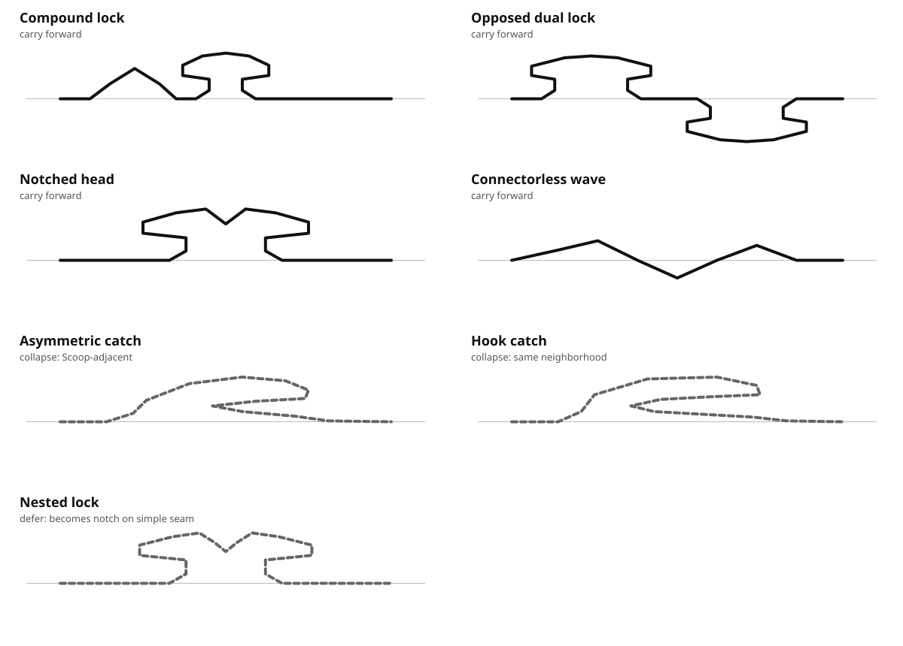

# Jigsaw Edge-Space Inventory

This document records the current inventory of ordinary Jigsaw seam structure and the development-only probes that should be explored before claiming that the connector/non-connector design space is mature.

It does **not** add production connector families. Production generation remains curated through `ConnectorGrammar`, `BaselineGrammar`, `SeamProgram`, and the existing Traditional / Unconventional policy.

## Scope

The inventory distinguishes three layers:

1. **non-connector course** — the approach/departure path between a true piece corner and the interlocking event;
2. **connector structure** — the local mating event or events shared by two ordinary neighboring pieces;
3. **piece topology** — how many boundary segments/neighbors a piece has and whether it remains one rectangular-grid cell.

The first two belong to ordinary seam exploration. The third belongs primarily to #191 and should not be smuggled into ConnectorGrammar.

A fourth axis cuts across the first two: **connector cardinality**. The current `SeamProgram` always contains exactly one connector. That means two legitimate structural questions remain open before the ordinary seam space can be called mature:

- can an interior seam intentionally contain **no interlocking event**, relying on course shape/image rather than a knob-like lock?
- when one seam contains several lock events, are they still one composite ConnectorProduction or do they deserve independent seam-level ownership?

The default answer should remain one connector until play evidence justifies changing that invariant.

## External cut survey

A small external survey was used to challenge the current catalog rather than to copy named commercial styles.

- Bob Armstrong's historical cutting-style classification describes not only knob cuts but long/thin arms and long/angular, long/round, long/jagged, long/wavy, long/bumpy, long/foot, and scroll-like cutting patterns; it also describes some such cuts as less interlocking. This is evidence that whole-boundary course and connector cardinality matter independently of ordinary knobs.
- Jack-in-the-Box Puzzles distinguishes knobby, swirly, artistic, and grid cuts; its swirly description explicitly calls out hooks, curls, swirls, and mushroom-like forms.
- Modern ribbon-vs-random descriptions consistently distinguish regular grid-aligned interlocks from irregular/freeform cuts with varied piece shapes.
- Whimsy/figural pieces are a topology/whole-piece phenomenon rather than evidence that ordinary four-sided seams need more connector labels.

References:

- https://www.oldpuzzles.com/history-techniques-styles/jigsaw-puzzle-cutting-styles-new-method-classification
- https://www.jitbpuzzles.com/styles.html
- https://puzzlemerchant.com/blogs/piece-of-mind-puzzle-blog/jigsaw-puzzle-ribbon-cut-vs-random-cut
- https://nautiluspuzzles.com/

The useful conclusion is not that Puzzle Forge should imitate historical labels. It is that the broader physical design space contains structural ideas—hooks, curls, long arms, scrolls, irregular courses, and figural topology—that our current ordinary connector catalog only partially samples.

## Current ordinary-seam coverage

The production connector catalog already covers a strong set of structural neighborhoods:

| Neighborhood | Current coverage |
| --- | --- |
| one ordinary protrusion | Classic bulb |
| overhanging head with neck/undercut | Necked head |
| repeated lateral crowns | Multi-lobe |
| one-sided back-biting sweep | Scoop |
| meaningful occupancy on both sides of the nominal edge | Serpentine |
| repeated orthogonal course changes | Terrace |
| repeated diagonal course changes | Zigzag |
| repeated radial chamber/waist cycles | Stacked lock |

The non-connector BaselineGrammar covers straight travel, same-side deflection, crossing, offset course, repetition, opposition, and longitudinal mirroring.

That is enough to make the current production vocabulary strong. It is not an exhaustive basis for every ordinary seam structure.

## Underexplored seam cardinality

Before adding connector families, explicitly probe the seam-level cases that today's `approach -> connector -> departure` model excludes.

### Connectorless interior seam

A shared interior boundary may be distinctive without containing a conventional lock event at all.

This is not the same as a flat seam: BaselineGrammar or a future course grammar could still produce a strong matching silhouette. Digital play also does not require physical friction to keep assembled sections together.

**Priority:** high as a development-only probe. Do not change the production seam contract until its solving value is demonstrated.

### Multiple connector events

The connector probes below intentionally keep several local lock events inside one composite ConnectorProduction. That is the conservative model.

Only promote connector cardinality above one at the `SeamProgram` level if independent event ownership materially improves generation, solving semantics, or safety. Avoid turning every local bump into a first-class connector.

## Underexplored connector neighborhoods

The development-only structural evaluation in `connectorProductionEvaluation.ts` maps all eight production families into one candidate AST and then defines probes outside the current catalog.

### Paired lock

Two separately legible lock events share one seam.

This is different from Multi-lobe because the events need not be copies of one another. A useful survivor should read as two clues with a deliberate relationship, not as visual clutter.

**Priority:** high.

### Opposed dual lock

Two full lock events occupy opposite sides of the nominal edge.

This goes beyond Serpentine's one crossing gesture because each side owns a complete mating event. It directly tests whether whole-seam tab/blank polarity remains the right abstraction.

**Priority:** high, but semantically disruptive.

### Asymmetric catch

A unilateral sweep, undercut, and head form a catch rather than a centered bulb/head or Scoop.

This revisits the useful part of the historical hook/curl neighborhood without assuming that a literal curl is geometrically safe.

**Priority:** high.

### Nested lock

One locking structure is contained inside another rather than appearing before or after it.

The existing connector programs are fundamentally serial. If nested geometry is compelling, ConnectorGrammar needs a hierarchical construct; pretending nesting is just another sequence would be dishonest.

**Priority:** medium-high.

### Notched head

A single cleft/notch changes the matching clue inside an otherwise coherent head.

This tests whether a cusp/notch can be an irreducible structural event instead of merely an angular rendering choice.

**Priority:** medium.

### Hook catch / longitudinal reversal

The seam deliberately moves forward, doubles back along the edge axis, forms a catch, and resumes.

The earlier Curl/Hook family failed because convincing curl geometry self-intersected. The broader longitudinal-reversal category has not been disproved; it needs a dedicated safety model rather than another hand-drawn curl attempt.

**Priority:** medium-high, geometry risk high.

### Mixed lock

Different lock motifs share one seam—for example, a lobe followed by a chamber/waist cycle.

This is the cleanest probe of structural hierarchy without adding a scale operator prematurely.

**Priority:** high.

## Visual probe outcome

The first canonical geometry pass is source-controlled in:

The pass intentionally includes rejected/collapsed specimens. Safety alone is not promotion.

### Carry forward

- **Compound lock** — paired-lock and mixed-lock read as one broader structural direction: multiple different lock events composed serially. Keep one exploration category rather than minting separate family labels.
- **Opposed dual lock** — survives distinctly. Two complete mating events on opposite sides read differently from Serpentine's single crossing gesture. This is the strongest challenge to whole-seam tab/blank polarity.
- **Notched head** — survives as a singular structural cleft inside an overhanging head. It remains visibly different from an ordinary Necked head at atlas scale.
- **Connectorless wave** — survives as a seam-level probe, not a connector family. It is the cleanest test of zero connector cardinality.

### Collapse or defer

- **Asymmetric catch** and **Hook catch** are both safe as simple open paths, but the visible results occupy the same Scoop-adjacent neighborhood. Do not preserve separate names merely because their structural descriptions differ.
- **Nested lock** does not survive as a distinct ordinary open-seam idea. Once forced into one simple boundary, visible nesting becomes a notch. True containment likely requires enclosed/branching geometry and therefore belongs closer to topology work.
- **Paired lock** versus **Mixed lock** is likewise not a useful family split. Both are examples of the broader Compound lock direction.

This leaves four geometries worth further seam-level testing and eliminates three proposed distinctions before production code is touched.

## Underexplored non-connector neighborhoods

Three limitations are now explicit rather than hidden inside the generic baseline explorer.

### Separated gestures

The current production AST treats `identity` as algebraic identity and removes it from sequences. That is correct normalization, but it means the language cannot say:

> gesture -> deliberate quiet baseline span -> second gesture

An explicit span-consuming baseline run is semantically different from algebraic identity. If visual exploration proves this useful, add a dedicated run/span concept rather than weakening identity normalization.

### Longitudinal reversal

The generic candidate validator requires monotonic travel along the edge. This intentionally excludes non-connector hooks/backtracks.

Do not remove that guard merely to generate more shapes. A reversal experiment needs its own bounded path and self-intersection rules first.

### Scale hierarchy

The generic realizer allocates longitudinal space uniformly across instructions. It can generate complicated structures, but it cannot structurally state that one gesture is dominant and another subordinate.

If this proves perceptually useful, the likely abstraction is local span allocation or hierarchical sub-production—not arbitrary extra named families.

## What is not an ordinary connector problem

The following remain topology rather than seam-vocabulary work:

- branching boundaries;
- enclosed holes or disconnected boundary components;
- circular/medallion pieces;
- pieces with arbitrary neighbor counts;
- multi-cell/L-shaped pieces;
- whole-piece figural/whimsy shapes;
- globally random/non-grid tessellation.

Those may reuse rendering and validation machinery, but they should stay conceptually under #191 unless a concrete implementation proves otherwise.

## Connector AST evaluation

The structural prototype supports:

- primitive events;
- ordered sequence;
- bounded repeat;
- opposition across the nominal edge;
- longitudinal mirroring;
- explicit nesting.

The structural skeleton of all eight current production families maps cleanly into that language. Their tuned runtime parameter/program types still remain necessary for current production realization.

That is enough evidence that a ConnectorProduction AST is useful as a **design/exploration language**.

It is not yet evidence that production ConnectorGrammar should be rewritten around it. The existing tuned realizers remain the production source of truth until a generic connector realizer can match their safety and visual quality.

## Promotion standard

An exploratory structure should be promoted only when all of these hold:

1. it can be realized deterministically and safely;
2. it remains legible when embedded in a complete approach -> connector -> departure seam;
3. it remains distinguishable at ordinary play scale, not merely when enlarged in an atlas;
4. it is not continuously reducible to an existing family through ordinary parameter changes;
5. reciprocal neighbor geometry and whole-piece safety remain exact;
6. it adds a useful solving clue or visual character rather than merely more event count;
7. it survives broad seeded sweeps without requiring hand-picked exceptions.

Zero promotions is an acceptable result.

## Next exploration sequence

1. Embed Compound lock, Opposed dual lock, Notched head, and Connectorless wave into complete development-only seams with representative BaselineGrammar approaches/departures.
2. Exercise reciprocal polarity/orientation and whole-piece safety for those seams; eliminate any candidate that only works as an isolated atlas specimen.
3. Extend the baseline explorer with an explicit separated-gesture experiment without changing production grammar.
4. Compare surviving complete seams against the existing connector/baseline atlases at normal play scale.
5. Promote only recurring, clearly irreducible survivors.
6. Keep true longitudinal reversal and nested/enclosed geometry behind stronger validation or topology work.
